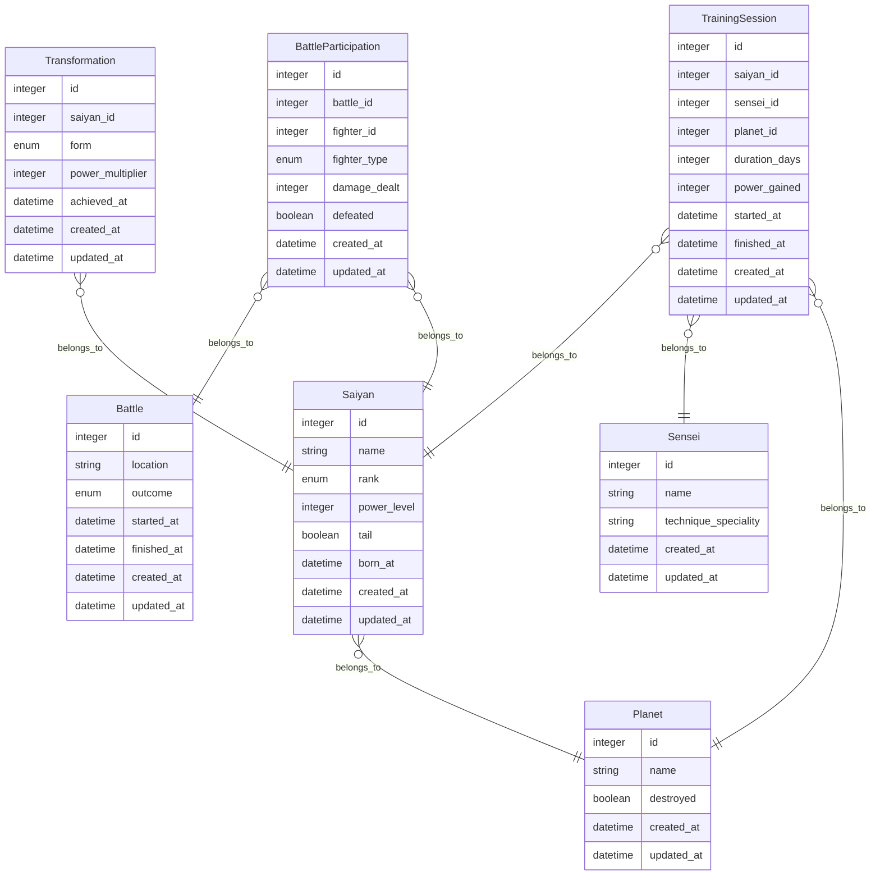

# Mermaid ERD


Generate Mermaid-compatible Entity Relationship Diagrams (ERDs) from your Rails models, with support for excluding specific models. Designed for modern Rails apps that use Active Record.

## Why?

Keeping ER diagrams up to date is usually manual, and they quickly go stale.
This gem generates a diagram directly from your Rails models, so your
documentation always reflects the current domain model with almost no effort.

## Features

- Outputs a Mermaid `erDiagram` to `documentation/domain-model.md`
- Includes all Active Record models with a database table
- Excludes models listed in `config/mermaid_erd.yml` under `exclude`
- Visualises `belongs_to` associations
- Run via a Rake task (`rake erd:generate`)
- Adds a post-migration reminder in development

## Requirements

- Ruby 3.4+
- Rails 8+
- PostgreSQL (uses array/enum column support)

## Installation

Add this line to the development section of your Gemfile:

```ruby
  gem "mermaid_erd"
```

Then install:

```bash
bundle install
```

Alternatively, install it directly:

```bash
gem install mermaid_erd
```

## Usage

Run the following Rake task to generate the ERD:

```bash
bundle exec rake erd:generate
```

This will output a Mermaid diagram to:

```
documentation/domain-model.md
```

### Customization

You can customize which models to exclude by creating a file at:

```yaml
# config/mermaid_erd.yml

exclude:
  - ActiveStorage::*
  - SolidQueue::*
  - Blazer::*
```
You can limit to specific models:

```yaml
# config/mermaid_erd.yml

only:
  - Order
  - Customer
  - Product
```

### Post-Migration Reminder

To remind developers to regenerate the diagram after each migration, this gem automatically hooks into `db:migrate` and prints a message like:

```
[ℹ] If this migration added or modified database tables, consider:
    • Updating the Mermaid ER diagram: bundle exec rake erd:generate
    • Excluding models in: config/mermaid_erd.yml
```

> ⚠ This task only runs in the development environment.

## Output Example

Example output (`documentation/domain-model.md`):


